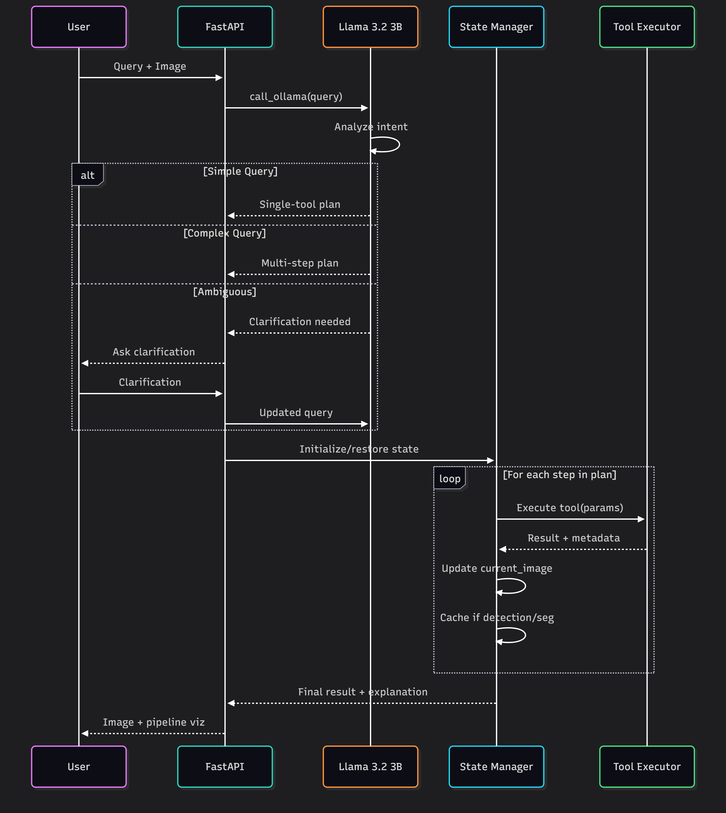
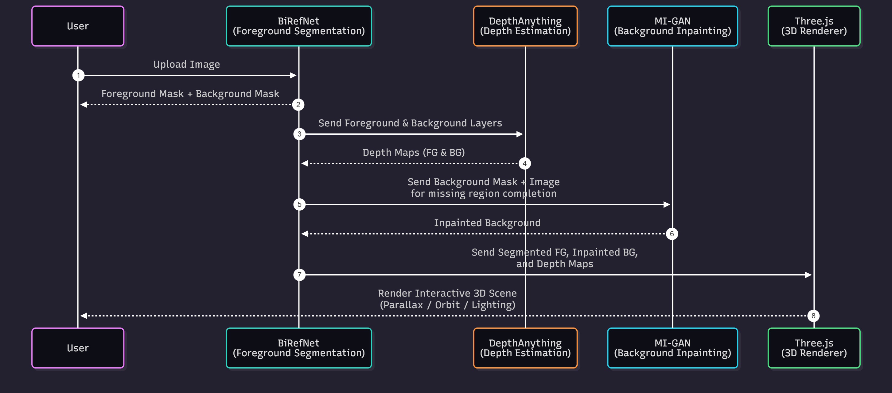
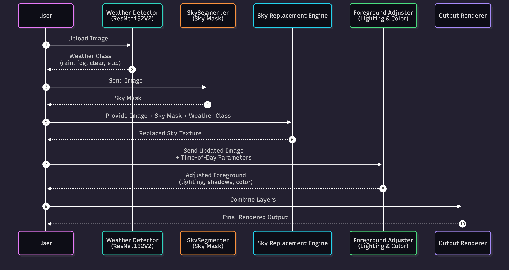

# 👩🏻‍💻Technical Documentation

**AI Photo Editor 2030 - Complete Technical Reference**

---

## 📋 Table of Contents

1. [Architecture Deep Dive](#architecture-deep-dive)
2. [AI Orchestrator](#ai-orchestrator)
3. [Tool Reference](#tool-reference)
4. [API Reference](#api-reference)
5. [Troubleshooting](#troubleshooting)
6. [Citations & References](#citations--references)

---

## ⚙️Architecture Deep Dive

### 🛠️System Overview


### 🧩Component Breakdown

#### 1. **🙋🏻‍♂️Client Layer**
- **React Web App** (Vite + React 18)
  - Progressive Web App (PWA) support
  - Real-time pipeline visualization
  - Session persistence with LocalStorage
  - WebSocket support for streaming results

- **React Native Mobile App**
  - iOS/Android native support
  - Gyroscope-based parallax control  

- **Streamlit Prototype**
  - Rapid prototyping 
  - Direct tools testing

#### 2. **✈️API Gateway (FastAPI)**

**Key Features:**
- Async request handling
- CORS enabled for cross-origin requests
- Multipart form handling (up to 100MB)
- Base64 image encoding/decoding
- Session state serialization

**Endpoints:**
```
GET  /                     - Health check + API info
GET  /health               - Server status
POST /tools/detect         - Object detection
POST /tools/segment        - Segmentation
POST /tools/inpaint        - Inpainting
POST /tools/parallax       - 3D parallax
POST /tools/theme_change   - Day/night transformation
POST /agent/run            - Thinking mode execution
POST /agent/undo           - Undo last operation
POST /quick_edit/execute   - Fast agent mode
POST /agent/process-voice  - Voice input processing
```

#### 3. **🧠Brainstorming Layer (Ollama)**

**Ollama Configuration:**
- **Endpoint:** `http://localhost:11434/api/chat`
- **Context Window:** 8192 tokens
- **Prediction Length:** 2048 tokens
- **Temperature:** 0.3 (low for deterministic planning)
- **Keep Alive:** 10 minutes (model stays loaded - KV caching)

---

## 🤖AI Orchestrator

### ⌛State Management

**GraphState Schema:**
```python
class GraphState(TypedDict):
    # Session
    session_id: str
    timestamp: str

    # Images
    current_image: np.ndarray          # Current working image
    original_image: np.ndarray         # Unmodified original
    image_history: List[np.ndarray]    # For undo/redo
    intermediate_images: List[np.ndarray]  # Pipeline steps

    # Conversation
    query: str                         # Current user query
    conversation_history: List[Dict]   # Full chat history
    context_summary: str               # Last 5 messages

    # Execution
    plan: List[Dict]                   # Planned tool sequence
    current_step: int                  # Execution progress
    pipeline_nodes: List[Dict]         # Executed steps (for viz)

    # Caching (optimization)
    cached_detections: List[Dict]      # Reuse detection results
    cached_segmentations: Dict         # Reuse segmentation masks

    # User interaction
    needs_clarification: bool
    clarification_question: str

    # Metadata
    status: str                        # idle, running, completed, error
    explain: str                       # Human-readable explanation
    confidence: float                  # 0.0-1.0
```

### 💭Planner Implementation and  Execution Flow

**Thinking Mode Workflow:**


---

## 🔧 Tool Reference

### 1. Object Detection (YOLO11n)

**Purpose:** Detect objects in images with bounding boxes and labels.

**Implementation:** `tools/detect.py`

**Model:**
- Architecture: YOLOv11 Nano
- Parameters: 2.6M
- Flops: 6.5B
- Model file size: 5.2 MB
- Input: RGB image (any size)
- Output: Bounding boxes + class labels + confidence scores

**Performance:**
- GPU (RTX 4090): 50-100ms
- CPU: 9s

**Memory:**  
- RAM: 276 MB
- GPU VRAM: 556 MB


---

### 2. General Segmentation (MobileSAM)

**Purpose:** Precise object segmentation given bounding boxes.

**Implementation:** `tools/seg.py`

**Model:**
- Architecture: Mobile Segment Anything Model
- Parameters: 10.1M
- FLOPs: 39B
- Model file size: 38.8 MB
- Input: RGB image + bbox prompt
- Output: Binary segmentation mask

**Performance:**
- GPU (RTX 4090): 800ms-1.2s
- CPU: 29s

**Memory:**  
- RAM: 294 MB
- GPU VRAM: 1.43 GB


---

### 3. Sky Segmentation

**Purpose:** Separate sky from foreground for theme changing.

**Implementation:** `tools/segmentation.py`

**Model:**
- Architecture: Bilateral Reference Network (BiRefNet)
- Parameters: 50.5M
- Model file size: **563 MB** (`best_ckpt.pt`)
- Input: RGB image (256×256 or larger)
- Output: Binary sky mask

**Performance:**
- **GPU (RTX 4090): 1.5–2.5 seconds**
- **CPU: 15–22 seconds**


---

### 4. Depth Estimation (Depth-Anything-V2)

**Purpose:** Generate depth maps for parallax effects.

**Implementation:** `tools/depth.py`

**Model:**
- Architecture: Depth Anything V2 Small
- Parameters: 24.8M
- FLOPs: 54B
- Model file size: 94.6 MB
- Input: RGB image
- Output: Normalized depth map (0-255)

**Performance:**
- GPU (RTX 4090): 1-1.5s
- CPU: 22s 

**Memory:**  
- RAM: 374 MB
- GPU VRAM: 680 MB


---

### 5. Inpainting (MI-GAN)

**Purpose:** Remove objects and fill regions intelligently.

**Implementation:** `tools/inpaint.py`

**Model:**
- Architecture: MI-GAN (ONNX INT8 quantized)
- Parameters: 7M
- FLOPS: 15.7B
- Model file size: 26.8 MB
- Input: RGB image + binary mask
- Output: Inpainted image

**Performance:**
- GPU (RTX 4090): 2-3s
- CPU: 130s

**Memory:**  
- RAM: 135 MB
- GPU VRAM: 354 MB


---

### 6. Super-Resolution (SwinIR)

**Purpose:** 4x upscaling with AI enhancement.

**Implementation:** `tools/sr.py`

**Model:**
- Architecture: Swin Transformer Image Restoration
- Parameters: 11M
- Flops: 6785B
- Model file size: 64 MB
- Input: RGB image (low resolution)
- Output: 4x upscaled image

**Performance:**
- GPU (RTX 4090): 3-5s
- CPU: 24s

**Memory:**  
- RAM: 436 MB
- GPU VRAM: 540 MB


### 7. Weather detection (ResNet)

**Purpose:** Classifying weather from the image.

**Implementation:** `tools/theme_changer.py`

**Model:**
- Architecture: Swin Transformer Image Restoration
- Parameters: 11M
- Flops: 1.8B
- Model file size: 229.8 MB
- Input: RGB image (low resolution)
- Output: 4x upscaled image

**Performance:**
- GPU (RTX 4090): 3-5s


### 8. Main Subject Segmentation (BiRefNet)

**Purpose:** Segments out main subject from the image.

**Implementation:** `tools/seg.py`

**Model:**
- Architecture: BirefNet
- Parameters: 68M
- Model file size: 444 MB
- Input: RGB image
- Output: Main Subject Mask image

**Performance:**
- GPU (RTX 4090): 120ms-140ms


### 9. 🧊3D Parallax Pipeline

**Purpose:** Convert static images to interactive 3D experiences.

**Implementation:** `tools/parallax.py`



**Three.js Viewer Features:**
- Mouse/gyroscope parallax control
- Smooth interpolation
- Depth map based pixel movements
- Mobile-optimized
- Self-contained HTML (inline assets)

**Performance (Full Pipeline):**
- GPU (RTX 4090): 2-4s 


---

### 10. 🔁Theme Changer (Day/Night)

**Purpose:** Transform images across different times of day with weather awareness.

**Implementation:** `tools/theme_changer.py`


**Weather Classes (11 total):**
- `clear`, `rain`, `fog_smog`, `snow`, `lightning`
- `rainbow`, `frost`, `glaze`, `hail`, `rime`, `sandstorm`

**Asset Structure:**
```
assets/day_night
├── dew/
│   ├── dew_01.png
│   ├── dew_02.png
│   ├── dew_03.png
│   ├── dew_04.png
│   └── dew_05.png
├── rain/
│   ├── rain_01.png
│   ├── rain_02.png
│   ├── rain_03.png
│   ├── rain_04.png
│   └── rain_05.png
└── ...
```

**Performance:**
- GPU (RTX 4090): 3-7s

---

## 🌐 API Reference

### FastAPI Endpoints
```bash
cd backend
python server.py
# Docs available at: http://localhost:8000/docs#/
```
---


## 🛠️ Troubleshooting

### Common Issues

**1. Ollama Connection Error**
```
Error: Connection refused to http://localhost:11434
```

**Solution:**
```bash
# Start Ollama server
ollama serve

# Check if running
curl http://localhost:11434/api/tags
```

---

**2. CUDA Out of Memory**
```
RuntimeError: CUDA out of memory
```

**Solution:**
```python
# Reduce batch size
# Enable lazy loading
# Clear cache between operations
torch.cuda.empty_cache()
```


---

## 📚 Citations & References

### Complete Bibliography

See [README.md](README.md) for BibTeX citations.

### 🔗 Additional Resources

- **YOLO11:** https://docs.ultralytics.com/models/yolo11/
- **MobileSAM Paper:** https://arxiv.org/abs/2306.14289
- **BiRefNet Paper:** https://arxiv.org/abs/2401.03407
- **Depth-Anything-V2:** https://github.com/DepthAnything/Depth-Anything-V2
- **SwinIR Paper:** https://arxiv.org/abs/2108.10257
- **Ollama Docs:** https://github.com/ollama/ollama/blob/main/docs/api.md
- **Gemma:** https://ai.google.dev/gemma/docs
- **Llama 3.2:** https://ai.meta.com/blog/llama-3-2/

---

## 📎 Appendix

### A. 🔑 Environment Variables
- [How to get a Deepgram API Key](https://developers.deepgram.com/docs/create-additional-api-keys)

```bash
# .env file inside backend
DEEPGRAM_API_KEY=your_key_here
```

### B. 💻 System Requirements

**Minimum:**
- Python 3.12
- 8GB RAM
- 5GB disk space
- CPU inference (slow but works)

**Recommended:(For 2030 feel)**
- Python 3.12
- 16GB+ RAM
- NVIDIA GPU with 8GB+ VRAM
- 10GB disk space (models + assets)
- CUDA 11.8+


### C. ⚡ API Rate Limits

**Ollama (Local):**
- No rate limits
- Limited by hardware

**Deepgram (Voice):**
- Free tier: 12,000 minutes/year
- Pay-as-you-go: $0.0043/minute

---

**Last Updated:** December 3, 2025
**Version:** 1.0.0
**License:** MIT
